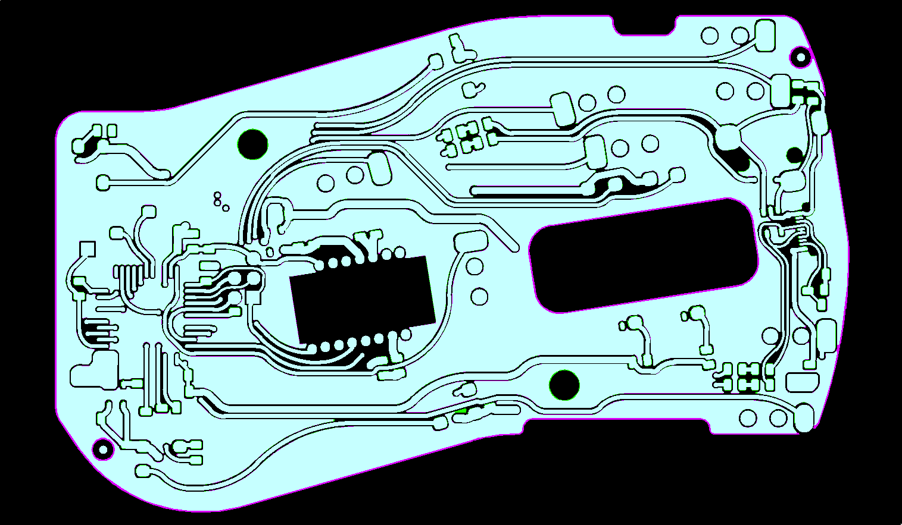
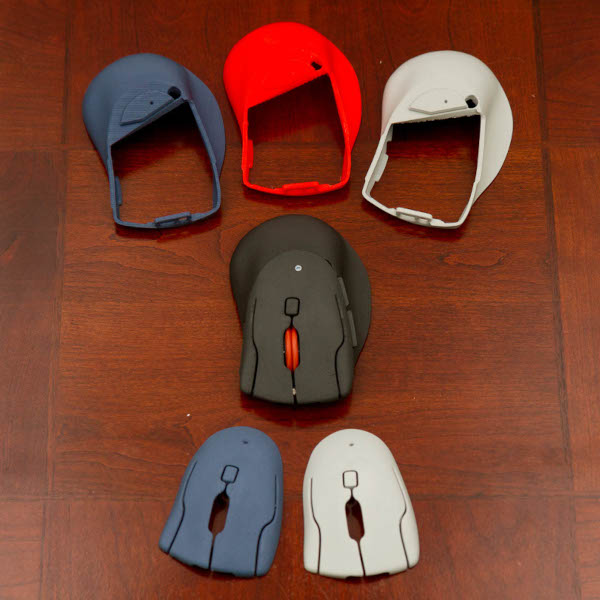

# DISCLAIMER
## How was this ported to KiCAD?

The heavy lifting was done by the [altium2kicad](https://github.com/thesourcerer8/altium2kicad) converter. If you like this port do consider donating to the converter project!

After that I took the converted files and pruned unnecessary ones. Then I fixed the schematics by replacing the broken symbols with either existing ones or created custom symbols.
All components have been named as they appear in the PCB to allow for relinking of the footprints with the `Update Schematic from PCB` option in eeschema.
Finally I fixed the DRC errors generated in the PCB (default design rule settings). This meant fixing the broken edge cut lines, due to the converter creating non closed and not fully connected lines. It also sprinkled some edge cut dots over the lines, which was not that easy to find!

### Can I use this port instead of the main project?

I don't think anything speaks against using this KiCAD version. But be warned that I haven't produced a PCB with it myself! So things could be broken!
If you just want a working PCB you should use Gerber files produced from the original version instead.

If you want to help verifying the design please do so!

### Current Validation

Validation has been done with the `Gerbv` tool, which allows to compare two Gerber files and show their difference/overlap.
The files used for the validation are located in ./gerber_diff_view`. There are also comparison shots of some layers in which the green corresponds to KiCAD and purple to Altium.

#### Labels:

Text is different due to fonts.
Drawings look correct.

#### Layers:

Only minimal difference due to difference in clearence to the border cut and filling algorithm.
KiCAD version has a bit more portions filled. This should not be an issue.

#### Edge Cuts:

Shape looks identical.
Only line width is different, but this doesn't change anything for the cut out PCB.
Probably due to KiCAD "Edge Cut" layer instead of "Board Outline".

#### Drill:
Drill holes look correct.
Mismatch on some holes that are not plated in the fabricated PCB, but Altium files still contain them as plated.
Should be no problem.

#### Drill Maps:
No drill mapped to optical sensor in KiCAD, but this should not be an issue.

#### Masks:
Match.

#### Pastes:
Match.

# The Ploopy Mouse

By some stroke of luck, you've made your way here. The Ploopy Mouse. Your life will never be the same.

This repository contains all of the design and production files necessary to make a Ploopy Mouse. We've also included some kick-ass documentation in the Wiki on how to get it made, assemble it, and program it.

What are you waiting for? Your new life awaits.

## QMK?!

Kits bought from the [Ploopy store](https://ploopy.co/product-category/mouse/) come with QMK preloaded. Check out the Wiki for instructions on how to load new firmware onto your device. (It's super easy!)

The firmware hex file that ships with all Mice is included in this repository as well, as `ploopyco_mouse_via.hex`. The hex was built with QMK version 0.11.1.

## Under what license is this released?

Everything in this repository is released under OHL CERN v2-S. Check the LICENSE.md file for full license text.

